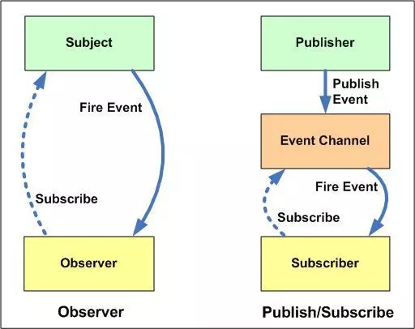

## 应用场景
需求 : 申请成功后，需要触发对应的订单、消息、审核模块对应逻辑
### 定义
发布-订阅是一种消息范式，消息的发布者，不会将消息直接发送给特定的订阅者，而是通过消息通道广播出去，然后呢，订阅者通过订阅获取到想要的消息。
### when
* 各模块相互独立
* 存在一对多的依赖关系,依赖模块不稳定、依赖关系不稳定

### 与观察者模式的区别

* 在观察者模式中，观察者是知道Subject的，Subject一直保持对观察者进行记录。然而，在发布订阅模式中，发布者和订阅者不知道对方的存在。它们只有通过消息代理进行通信。
* 在发布订阅模式中，组件是松散耦合的，正好和观察者模式相反。
* 观察者模式大多数时候是同步的，比如当事件触发，Subject就会去调用观察者的方法。而发布-订阅模式大多数时候是异步的（使用消息队列）
* 观察者模式需要在单个应用程序地址空间中实现，而发布-订阅更像交叉应用模式
### before
```
function applySuccess() {
    // 通知消息中心获取最新内容
    MessageCenter.fetch();
    // 更新订单信息
    Order.update();
    // 通知相关方审核
    Checker.alert();
}
```

### after
封装eventEmitter
```
const EventEmit = function() {
  this.events = {};
  this.on = function(name, cb) {
    if (this.events[name]) {
      this.events[name].push(cb);
    } else {
      this.events[name] = [cb];
    }
  };
  this.trigger = function(name, ...arg) {
    if (this.events[name]) {
      this.events[name].forEach(eventListener => {
        eventListener(...arg);
      });
    }
  };
};
```
业务代码改动
```
let event = new EventEmit();
event.trigger('success');

MessageCenter.fetch() {
  event.on('success', () => {
    console.log('更新消息中心');
  });
}
Order.update() {
  event.on('success', () => {
    console.log('更新订单信息');
  });
}
Checker.alert() {
  event.on('success', () => {
    console.log('通知管理员');
  });
}
```