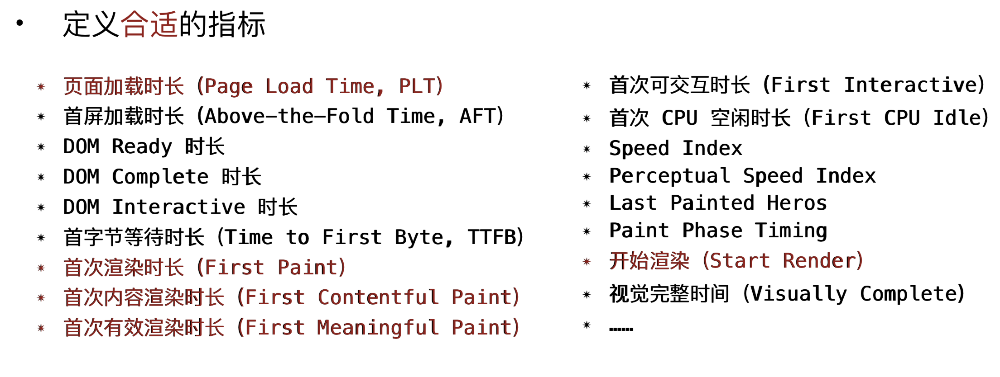
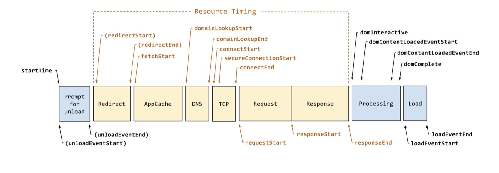

## 监控指标
### crash
    1. performance.onresourcetimingbufferfull
    ```
    function buffer_full(event) {
        console.log("WARNING: Resource Timing Buffer is FULL!");
        performance.setResourceTimingBufferSize(200);
    }
    function init() {
        // Set a callback if the resource buffer becomes filled
        performance.onresourcetimingbufferfull = buffer_full;
    }
    <body onload="init()">
    ```
### High Resolution Time
* 一个高精度，一个单调递增，保证了我们在提取性能指标的时候，不会受宿主环境的一些时间影响。
* PerformanceTimeline API是在HRTime基础之上

### 合适的指标


### RUM性能模型


### performance
* performance.getEntriesByType("navigation")，DNS、TCP、首字节、html 传输等耗时

* performance.getEntriesByType("resource")，页面所有静态资源的加载耗时。

* performance.getEntriesByType("paint") **chrome 高版本**

### 首屏时间
    * DOMContentLoaded
        
        当初始的 HTML 文档被完全加载和解析完成之后，DOMContentLoaded 事件被触发，而无需等待样式表、图像和子框架的完全加载。另一个不同的事件 load 应该仅用于检测一个完全加载的页面。 这里有一个常见的错误，就是在本应使用 DOMContentLoaded 会更加合适的情况下，却选择使用 load，所以要谨慎。注意：DOMContentLoaded 事件必须等待其所属script之前的样式表加载解析完成才会触发
    * first contentful paint (FCP)
        
        浏览器首次呈现有意义的任何内容的时间，该时间包括文本，前景或背景图像，画布或SVG。
    * first meaningful paint (FMP)
        
        反映主要内容出现在页面上所需的时间，也侧面反映了服务器输出任意数据的速度。FMP 时间过长一般意味着 JavaScript 阻塞了主线程，也有可能是后端/服务器的问题。
    * largest contentful paint (LCP)
        
        最大内容绘制（LCP）指标表示视口中可见的最大内容元素的渲染时间，light
    * time to interactive (TTI)
        
        在此时间点，页面布局已经稳定，主要的网络字体已经可见，主线程已可以响应用户输入 — 基本上意味着只是用户可以与 UI 进行交互。是描述“网站可正常使用前，用户所需要等待的时长”的关键因素。
    * 首次输入延迟（First Input Delay，FID 或 Input responsiveness）
        
        从用户首次与页面交互，到网站能够响应该交互的时间。与 TTI 相辅相成，补全了画像中缺少的一块：在用户切实与网站交互后发生了什么
    * 速度指数（Speed Index）[https://dev.to/borisschapira/web-performance-fundamentals-what-is-the-speed-index-2m5i]
        
        衡量视觉上页面被内容充满的速度，数值越低越好。速度指数由视觉上的加载速度计算而得，只是一个计算值。同时对视口尺寸也很敏感，因此你需要根据目标用户设定测试配置的范围。
    

### 网络性能
### 内存
  * performance.memory
  ```
  {
      jsHeapSizeLimit,
      totalJSHeapSize,
      usedJSHeapSize
  }
  ```

### fps (frames per second)
    <60时，用户体验会好

### 首字节时间（Time To First Byte）TTFB
* 首次请求 web 服务器和 web 服务器响应到终端用户之间这段时间

#### 三个步骤
1. 向站点地址提交首次请求
    * DNS 响应时间（终端用户侧解析 DNS 请求有多块）
    * 网站服务器到终端用户的距离，越短越好
    * 网络稳定性
2. 由 web 服务器解析本次请求
    * 物理硬件响应时间 （web 服务器解析请求有多快）
    * 既有的服务器操作负载
    * 数据中心任何网络相关的延迟
3. 向终端用户发送首个响应
    * 终端用户的网速
    * 连接稳定性

#### 如何优化
* 首次启动时呈现静态数据（源服务器只用来处理新内容，CDN 缓存静态数据）
* 使用 CDN，也就是让站点内容离终端用户更近
* 代码优化：软件设置、编码性能的改善都能加快首次页面渲染
* 数据库查询优化：必须对数据库规范化和数据库操作进行全面检查
* 将数据缓存到内存中
* 尽可能使用最新的硬件，如新的 CPU、SSD 或 NVME 的固态硬盘
